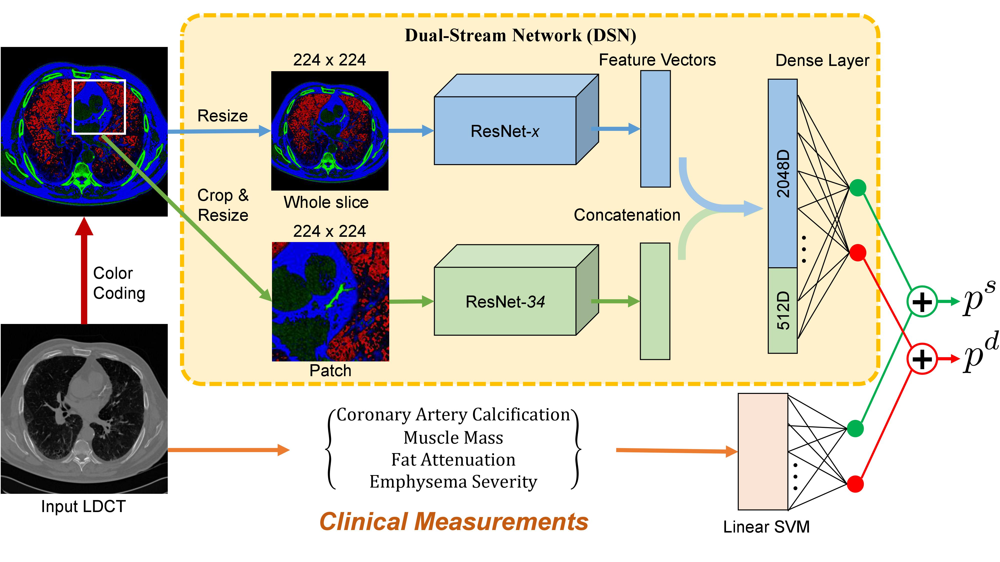

# Knowledge-based Analysis for Mortality Prediction from CT Images (KAMP-Net)

The code in this repository implements KAMP-Net(https://ieeexplore.ieee.org/document/8861325), a hybrid framework for predicting mortality risk using NLST low-dose CT images and clinical measurements. 

